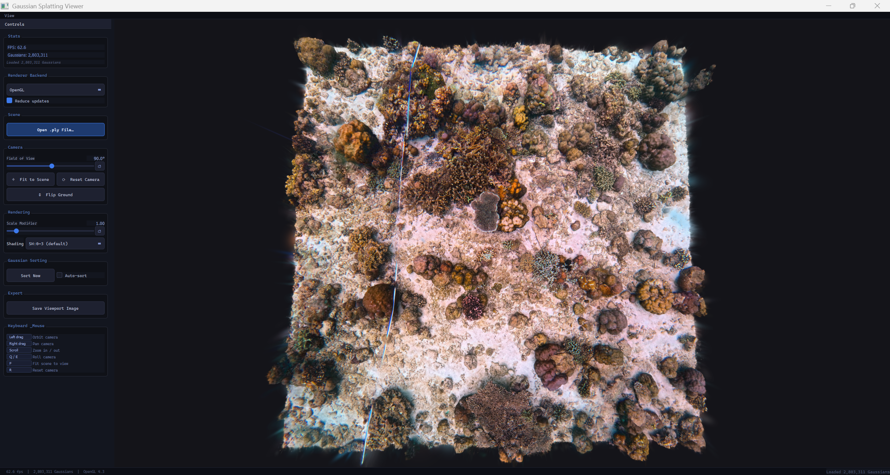

# pyvista-gs

PyVista-backed Gaussian Splatting viewer packaged as an installable Python module.
`GaussianActor` is the main reusable integration point: it can be embedded in
other PyVista or Qt applications and behaves like a normal actor from the outside,
even though the actual splat rendering is handled by a custom OpenGL backend.



## Install

```bash
pip install -e .
# if/when published to PyPI:
# pip install pyvista-gs
```

## Run

```bash
pyvista-gs
python -m gs_viewer
python -m gs_viewer --hidpi    # 1.5x font scale on HiDPI displays
```

## GaussianActor

Use `GaussianActor` when you want to add 3D Gaussian splats to an existing app:

```python
from gs_viewer import GaussianActor, load_ply

gaussians = load_ply("/path/to/point_cloud.ply")
actor = GaussianActor(gaussians)
actor.bind_to_plotter(plotter)
```

`GaussianActor` also supports non-destructive crop preview through
`set_crop_bounds(...)`, with an explicit `apply_crop_box()` commit step when you
want to permanently remove the splats outside the box.

The "hack" is that `GaussianActor` builds an invisible `pv.PolyData`/
`pv.Actor` anchor and then hooks PyVista's render-end callback to sync and draw
with the custom OpenGL renderer. To the rest of your application it looks like a
first-class PyVista actor, but the splats are still rendered by our own backend.

If you want the full window instead of embedding, import `MainWindow`. If you
want the reusable Qt sidebar in your own app, import `ControlPanel`.

Optional CUDA sorting backends (`torch` or `cupy`) are detected at runtime and
used only when installed.
